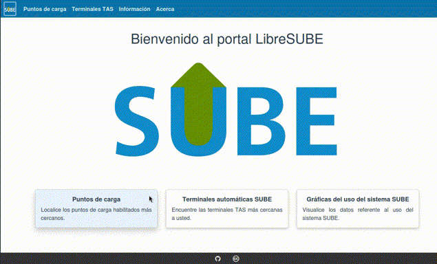

# LibreSube

## Proposito
**LibreSUBE** es una aplicación de página única (Single-page application) que reúne y muestra información del *Sistema Único de Boleto Electrónico* (**SUBE**) de la *República Argentina* tales como la ubicación de los puntos de carga, terminales de autoservicio, e información de la utilización del sistema. Toda la información reunida y visualizada en esta aplicación se basan en datos primarios generados por el sistema **SUBE**.


## Vista previa
<p align="center">
    
</p>

## Instalación
```
npm install
```

### Compilación con hot-reloads para desarrollo
```
npm run serve
```

### Compilacíon para salida a producción
```
npm run build
```
